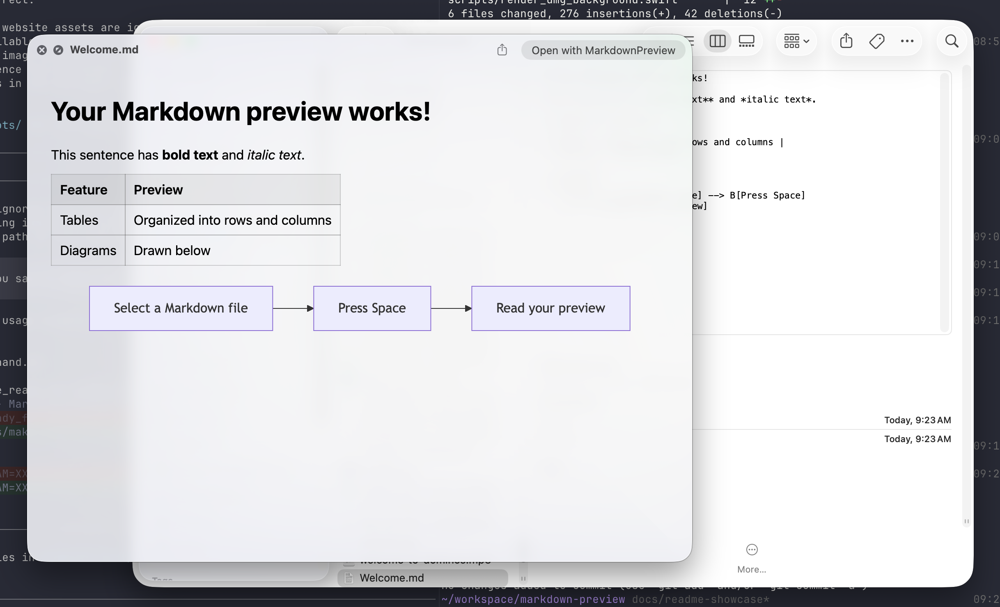
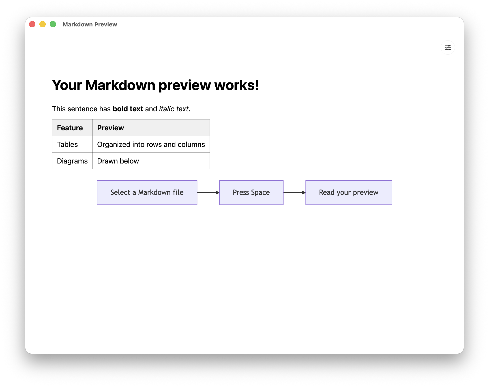
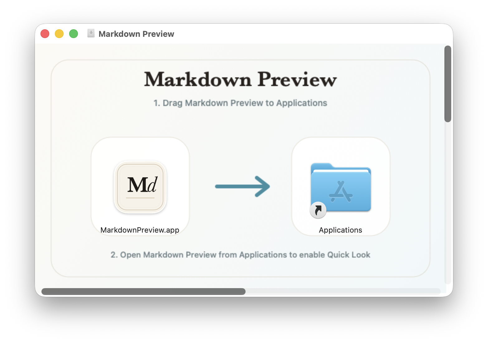
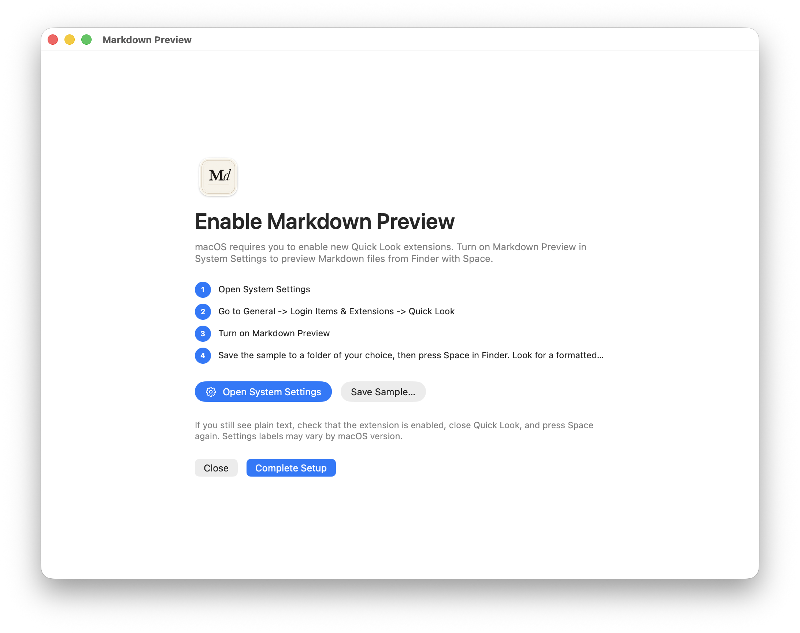

# Markdown Preview

**Select a Markdown file. Press Space. Read it beautifully.**

Markdown Preview brings formatted text, tables, images, and Mermaid diagrams to Finder's Quick Look. Browse READMEs, project notes, and technical docs without opening an editor.

[Install and try it](#install-and-try-it) · [Features](#read-edit-and-create) · [Developer guide](#developer-guide)



*A single press of Space turns Markdown source into a readable document, including tables and diagrams.*

## Read, Edit, and Create

Open a document in Markdown Preview for a clean reading view. When you need to make changes, expand the toolbar to edit, save, or create a new file.



- **Read in Finder:** preview `.md` and `.markdown` files without leaving your folder.
- **See the structure:** render headings, lists, tables, code blocks, local images, and Mermaid diagrams.
- **Make a quick edit:** switch between Markdown source and preview, with save prompts protecting unsaved edits when closing or quitting.
- **Start from rich text:** paste formatted content into the converter and copy the Markdown equivalent, including lists, links, tables, and code.

Requires **macOS 13.0 or newer**. Released under the [MIT License](LICENSE).

## Install and Try It

Requires **macOS 13.0 or newer**. You do not need Xcode to use a packaged app.

1. Open the `MarkdownPreview.dmg` supplied with your build and drag **MarkdownPreview** into **Applications**.
2. Launch Markdown Preview from Applications and click **Open System Settings**.
3. Enable Markdown Preview under **General → Login Items & Extensions → Quick Look**. The location and labels can vary by macOS version.
4. Return to the app and click **Save Sample…**, then choose a folder such as Documents. Finder reveals the saved `Welcome.md`; press **Space**.
5. Check that you see a formatted heading, a table, and a diagram. Close the preview, return to the app, and click **Complete Setup**.

You can choose **Close** to use the app immediately without marking setup complete. To return to setup, expand **Show advanced options** (the sliders icon), then click **Quick Look setup** (the gear icon). Once setup is complete, the setup page shows only **Close** at the bottom.

If you only have the source code, see [Developer Guide](#developer-guide) to build the app.

<details>
<summary>See installation and setup screenshots</summary>

### Install in Applications



### Enable Finder Previews



</details>

Setup completion is remembered per release. A new release shows setup again on a normal launch; opening a document bypasses it for that session. Reinstalling the same release preserves completion. You can always reopen setup with the gear button in the advanced toolbar.

## Use Markdown Preview

- **Preview in Finder:** select a `.md` or `.markdown` file and press **Space**.
- **Open in the app:** use Finder’s **Open With → MarkdownPreview**, or expand the app’s advanced options and click the folder icon.
- **Edit:** expand advanced options and click the pencil. Click the eye to preview your edits, and the save icon to save. Unsaved edits trigger a Save / Discard / Cancel prompt when closing, quitting, or switching files.
- **Create a file:** choose **File → New Markdown File** or press **⌘N**. Save to choose a filename and location.
- **Convert rich text:** while editing, click **Convert rich text to Markdown**, paste formatted text into the Rich Text pane, then click **Copy Markdown**. Click **Done** and paste the result into your document.

### If Finder Shows Plain Text

Check that the Quick Look extension is enabled in System Settings. Close the preview and press Space again. If it still does not render, try quitting and reopening Markdown Preview, then log out and back in if necessary. You can reopen **Quick Look setup** from advanced options to try the sample again.

### Remove the App

Quit Markdown Preview, turn off its Quick Look extension in System Settings, and move MarkdownPreview from Applications to the Trash. Your Markdown documents remain where you saved them.

## Supported Markdown

- Headings (`#` through `######`)
- Paragraphs
- Unordered and ordered lists
- Blockquotes
- Tables
- Fenced code blocks (```)
- Mermaid diagrams in fenced `mermaid` code blocks
- Inline code, emphasis, strong emphasis, strikethrough
- Links
- Local image references

Markdown Preview uses a lightweight built-in renderer. It is not a full CommonMark or GitHub Flavored Markdown implementation.

## Developer Guide

The sections below cover building, signing, packaging, and troubleshooting development installations.

Current release: **v.20260915** (macOS bundle version `2026.9.15`, build `1`).

### Requirements

- macOS 13.0 or newer
- Full Xcode app, not only Command Line Tools

### Project Layout

- `App/`: host macOS app used to install and contain the extension
- `Extension/`: Quick Look preview extension implementation
- `Brand/`: source SVG brand assets
- `Config/`: shared and local signing configuration
- `MarkdownPreview.xcodeproj/`: Xcode project with the app and extension targets

### Signing

This must be set up once in Xcode.

### Build And Run

Open `MarkdownPreview.xcodeproj` in Xcode, select the `MarkdownPreview` scheme, and run it.

You can also build from Terminal:

```bash
make build
```

Run the renderer checks with `make test`. Before distributing a build, follow the [manual release checks](Tests/manual-release-checks.md) for document safety and first-time setup.

To regenerate brand PNGs and app icon images from SVG sources:

```bash
make assets
```

### Release Outside The App Store

Create a Developer ID signed, notarized, and stapled Release DMG:

```bash
xcrun notarytool store-credentials "sojoodi-macapp-notary" \
  --team-id "YOURTEAMID" \
  --apple-id "YOUR_APPLE_ID" \
  --password "APP_SPECIFIC_PASSWORD"

make release
```

`make release` reads `DEVELOPMENT_TEAM` from ignored `Config/LocalSigning.xcconfig` by default. You can override release settings without editing files:

```bash
make release \
  DEVELOPER_ID_TEAM=YOURTEAMID \
  DEVELOPER_ID_IDENTITY="Developer ID Application" \
  NOTARY_PROFILE="sojoodi-macapp-notary"
```

The generated notarized disk image is written to `.build/Dist/MarkdownPreview.dmg`.

### Install a Development Build

Install the built app:

```bash
make install
```

Launch Markdown Preview and use the setup screen to open `System Settings`.
Then enable the extension:

`General` -> `Login Items & Extensions` -> `Quick Look` -> `Markdown Preview`

Then select a `.md` or `.markdown` file in Finder and press `Space`.

To uninstall the app and disable its Quick Look extension:

```bash
make uninstall
```

### Refresh Quick Look

If Finder still shows plain text, refresh Quick Look:

```bash
make refresh
```

If double-clicking Markdown files opens an old build or archived copy of the app, reset the local file handlers:

```bash
make fix-file-handlers
```

### Registered UTTypes

- `com.sojoodi.markdown`
- `public.markdown`
- `net.daringfireball.markdown`
- `net.multimarkdown.text`

## License

Markdown Preview is released under the MIT License. See [LICENSE](LICENSE).
