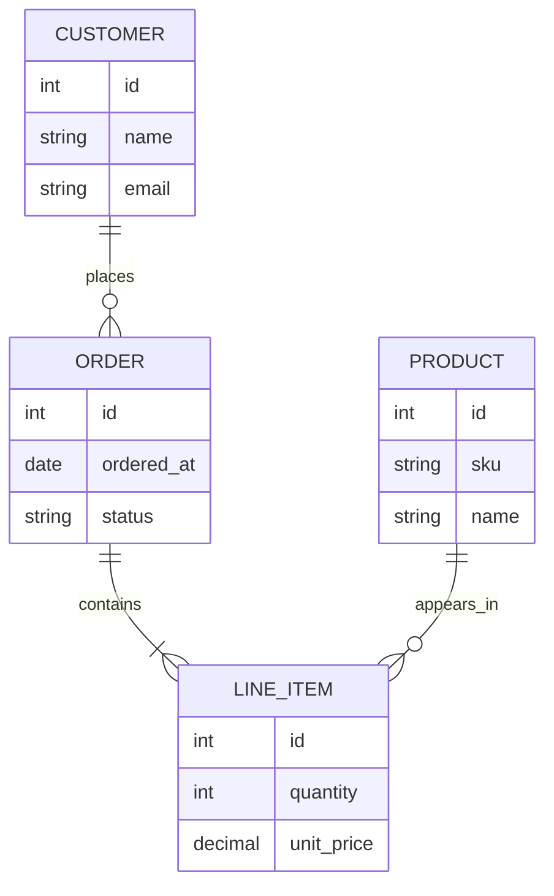
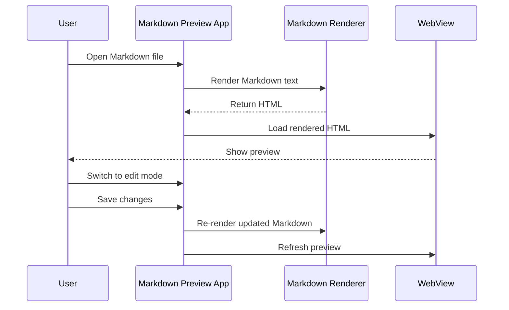

# Markdown Rendering Sample

This file is intended for testing Markdown Preview rendering. It includes regular prose, **bold text**, *italic text*, ***bold italic text***, `inline code`, and a [link to the project README](../README.md).

## Bullets

* First level item with **bold emphasis**
  * Second level item with *italic emphasis*
  * Second level item with `inline code`
    * Third level item with a [relative link](../LICENSE)
* First level item 2
  * Second level item 2
  * Second level item 3

## Numbered List

1. Open a Markdown file.
2. Switch into edit mode.
3. Save the changes.
4. Return to preview mode.

## Table

| Feature | Expected Rendering | Status |
| --- | --- | ---: |
| Bullets | Nested indentation is preserved | 1 |
| Formatting | Bold, italic, and code render inline | 2 |
| Links | Relative and external links are clickable | 3 |
| Mermaid | Diagrams render visually, not as source text | 4 |

## Mermaid ERD

## Mermaid Sequence Diagram

