# Sample System Architecture

This sample describes a multi-tenant commerce platform. Each tenant manages its
users, catalog, stock, orders, payments, and fulfillment. The ERD shows the main
records and relationships across those domains.

## System Context

```text
Customers ── Storefront ── Commerce API ── PostgreSQL
                                │              ├── Catalog and pricing
                                │              ├── Orders and payments
                                │              └── Inventory and fulfillment
                                ├── Payment provider
                                ├── Shipping provider
                                └── Event queue ── Webhook workers
```

## Entity Relationship Diagram

```mermaid
erDiagram
    TENANT ||--o{ APP_USER : employs
    TENANT ||--o{ ROLE : defines
    APP_USER ||--o{ USER_ROLE : receives
    ROLE ||--o{ USER_ROLE : grants

    TENANT ||--o{ CUSTOMER : serves
    CUSTOMER ||--o{ ADDRESS : saves
    TENANT ||--o{ PRODUCT : catalogs
    PRODUCT ||--o{ PRODUCT_VARIANT : offers
    PRODUCT ||--o{ PRODUCT_CATEGORY : classified_as
    CATEGORY ||--o{ PRODUCT_CATEGORY : contains

    TENANT ||--o{ WAREHOUSE : operates
    WAREHOUSE ||--o{ INVENTORY : stores
    PRODUCT_VARIANT ||--o{ INVENTORY : stocked_as
    INVENTORY ||--o{ STOCK_MOVEMENT : records
    APP_USER o|--o{ STOCK_MOVEMENT : records

    CUSTOMER ||--o{ CUSTOMER_ORDER : places
    TENANT ||--o{ CUSTOMER_ORDER : receives
    CUSTOMER_ORDER ||--|{ ORDER_LINE : contains
    PRODUCT_VARIANT ||--o{ ORDER_LINE : ordered_as
    CUSTOMER_ORDER ||--o{ ORDER_PROMOTION : applies
    PROMOTION ||--o{ ORDER_PROMOTION : redeems
    CUSTOMER_ORDER ||--o{ PAYMENT : collects
    PAYMENT ||--o{ PAYMENT_TRANSACTION : attempts
    PAYMENT ||--o{ REFUND : returns
    CUSTOMER_ORDER ||--o{ INVOICE : billed_as
    TAX_RATE ||--o{ ORDER_LINE : calculates

    CUSTOMER_ORDER ||--o{ SHIPMENT : fulfills
    WAREHOUSE ||--o{ SHIPMENT : dispatches
    SHIPMENT ||--|{ SHIPMENT_ITEM : contains
    ORDER_LINE ||--o{ SHIPMENT_ITEM : fulfills

    TENANT ||--o{ SUPPLIER : sources_from
    SUPPLIER ||--o{ PURCHASE_ORDER : receives
    WAREHOUSE ||--o{ PURCHASE_ORDER : delivers_to
    PURCHASE_ORDER ||--|{ PURCHASE_ORDER_LINE : contains
    PRODUCT_VARIANT ||--o{ PURCHASE_ORDER_LINE : replenishes

    TENANT ||--o{ AUDIT_EVENT : tracks
    APP_USER o|--o{ AUDIT_EVENT : performs
    TENANT ||--o{ WEBHOOK_DELIVERY : configures
    CUSTOMER_ORDER o|--o{ WEBHOOK_DELIVERY : triggers

    TENANT {
        uuid id PK
        string name
        string slug UK
        datetime created_at
    }
    APP_USER {
        uuid id PK
        uuid tenant_id FK
        string email
        string display_name
        boolean is_active
    }
    ROLE {
        uuid id PK
        uuid tenant_id FK
        string name
    }
    USER_ROLE {
        uuid user_id PK, FK
        uuid role_id PK, FK
        datetime assigned_at
    }
    CUSTOMER {
        uuid id PK
        uuid tenant_id FK
        string email
        string full_name
        datetime created_at
    }
    ADDRESS {
        uuid id PK
        uuid customer_id FK
        string label
        string country_code
        string postal_code
    }
    PRODUCT {
        uuid id PK
        uuid tenant_id FK
        string sku UK
        string name
        string status
    }
    PRODUCT_VARIANT {
        uuid id PK
        uuid product_id FK
        string sku UK
        string option_values
        decimal current_price
    }
    CATEGORY {
        uuid id PK
        uuid tenant_id FK
        uuid parent_id FK
        string name
    }
    PRODUCT_CATEGORY {
        uuid product_id PK, FK
        uuid category_id PK, FK
    }
    WAREHOUSE {
        uuid id PK
        uuid tenant_id FK
        string name
        string country_code
    }
    INVENTORY {
        uuid id PK
        uuid warehouse_id FK
        uuid variant_id FK
        int on_hand
        int reserved
    }
    STOCK_MOVEMENT {
        uuid id PK
        uuid inventory_id FK
        uuid actor_user_id FK
        int quantity_delta
        string reason
        datetime created_at
    }
    CUSTOMER_ORDER {
        uuid id PK
        uuid tenant_id FK
        uuid customer_id FK
        uuid billing_address_id FK
        uuid shipping_address_id FK
        string status
        string currency
        datetime placed_at
    }
    ORDER_LINE {
        uuid id PK
        uuid order_id FK
        uuid variant_id FK
        uuid tax_rate_id FK
        int quantity
        decimal unit_price
        decimal tax_amount
    }
    PROMOTION {
        uuid id PK
        uuid tenant_id FK
        string code
        string discount_type
        decimal discount_value
        datetime expires_at
    }
    ORDER_PROMOTION {
        uuid order_id PK, FK
        uuid promotion_id PK, FK
        decimal discount_amount
    }
    PAYMENT {
        uuid id PK
        uuid order_id FK
        string provider
        string status
        decimal amount
        string currency
    }
    PAYMENT_TRANSACTION {
        uuid id PK
        uuid payment_id FK
        string provider_reference UK
        string transaction_type
        string status
        datetime created_at
    }
    REFUND {
        uuid id PK
        uuid payment_id FK
        string provider_reference
        decimal amount
        string status
        datetime requested_at
    }
    INVOICE {
        uuid id PK
        uuid order_id FK
        string invoice_number UK
        decimal total
        string status
        datetime issued_at
    }
    TAX_RATE {
        uuid id PK
        uuid tenant_id FK
        string region_code
        decimal percentage
        datetime effective_from
    }
    SHIPMENT {
        uuid id PK
        uuid order_id FK
        uuid warehouse_id FK
        string carrier
        string tracking_number
        string status
    }
    SHIPMENT_ITEM {
        uuid shipment_id PK, FK
        uuid order_line_id PK, FK
        int quantity
    }
    SUPPLIER {
        uuid id PK
        uuid tenant_id FK
        string name
        string contact_email
    }
    PURCHASE_ORDER {
        uuid id PK
        uuid supplier_id FK
        uuid warehouse_id FK
        string reference UK
        string status
        datetime expected_at
    }
    PURCHASE_ORDER_LINE {
        uuid id PK
        uuid purchase_order_id FK
        uuid variant_id FK
        int quantity_ordered
        decimal unit_cost
    }
    AUDIT_EVENT {
        uuid id PK
        uuid tenant_id FK
        uuid actor_user_id FK
        string entity_type
        uuid entity_id
        string action
        datetime occurred_at
    }
    WEBHOOK_DELIVERY {
        uuid id PK
        uuid tenant_id FK
        uuid order_id FK
        string event_type
        string status
        int attempt_count
        datetime delivered_at
    }
```



## Architecture Notes

- Every tenant-owned record is scoped by `tenant_id`, directly or through its
  parent record. Queries must enforce that boundary.
- Product variants carry sellable SKUs and prices. Inventory is tracked per
  variant and warehouse; stock movements provide the adjustment history.
- Orders keep address references and line-item price and tax snapshots so later
  catalog or address changes do not rewrite the order record.
- Payments record provider attempts separately from refunds. Shipment items link
  shipped quantities back to the lines they fulfill.
- Audit events and webhook deliveries record operational activity without
  coupling the order write to downstream processing.

## Order Placement Flow

1. Resolve the tenant and customer from the storefront request.
2. Check variant availability across the tenant's active warehouses.
3. Create the order and line snapshots, then reserve inventory.
4. Create a payment and send the authorization request to the provider.
5. On success, confirm the order and enqueue fulfillment and webhook events.
6. Create shipments as items leave a warehouse; record refunds as separate
   transactions when an order is returned or canceled.
